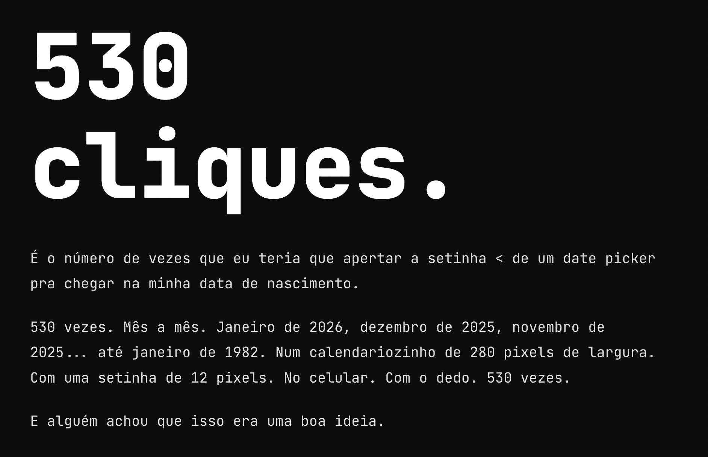

# 530 Cliques

**É o número de vezes que eu teria que clicar pra chegar na minha data de nascimento num date picker.**

Um manifesto-interativo sobre por que date pickers de calendário não devem ser usados para data de nascimento.

**[felipebossolani.github.io/530-cliques](https://felipebossolani.github.io/530-cliques/)**

## O que é

- Calculadora de cliques baseada no seu ano de nascimento
- Date picker funcional pra sentir a dor na pele
- Demo da solução correta: 3 campos de texto simples
- Muro da vergonha com os piores exemplos do mercado

## Stack

HTML + CSS + JS puros. Zero dependências. Zero build step. Um único `index.html`.

## Referências

- [Zuko Blog: "Optimizing Date Fields on Forms"](https://www.zuko.io/blog/optimizing-date-fields-on-forms) (dez/2025)
- [Smashing Magazine: "Designing Birthday Picker UX: Simpler Is Better"](https://www.smashingmagazine.com/2021/05/frustrating-design-patterns-birthday-picker/)
- [NN/g: "Date-Input Form Fields: UX Design Guidelines"](https://www.nngroup.com/articles/date-input/)
- [Gov.uk: "Memorable date" pattern](https://design-system.service.gov.uk/patterns/dates/) — 3 campos de texto simples
- shadcn/ui issues: [#546](https://github.com/shadcn-ui/ui/issues/546), [#2229](https://github.com/shadcn-ui/ui/issues/2229), [#2982](https://github.com/shadcn-ui/ui/issues/2982)
- [CEP Primeiro](https://felipebossolani.github.io/cep-primeiro/) (projeto irmão)
